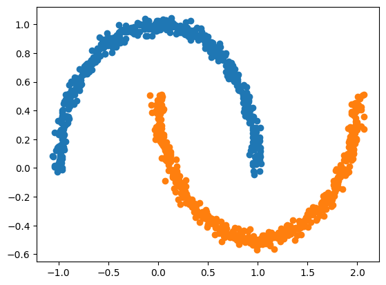

# Simple Diffusion model on two moons distribution

The goal is to train a diffusion model for 2D points to generate the two moons distribution.

# Method

I follow the flow matching framework to build a probability path from a simple distribution (e.g., Gaussian) `p` to the target distribution (two moons) `q`. The model learns a time-dependent vector field that transports samples from `p` to `q` via a mean squared error objective between the predicted and true velocity fields.

We define a linear probability path where the sample xt at time `t` is:

xt = (1 - t) * x0 + t * x1

with x0 ~ `q` and x1 ~ `p`. The target velocity field along this path is:

v(xt, t) = x1 - x0

# Metrics

The metrics used to evaluate the model are:

- **Wasserstein Distance**: Computes the Earth Mover's Distance between normalized generated and target distributions using optimal transport. It measures the minimum cost to transform one distribution into another, where cost is based on Euclidean distance between sample points. Lower values indicate better distributional matching.

- **MMD (Maximum Mean Discrepancy)**: Uses an RBF (Radial Basis Function) kernel to compare two distributions by how similar their samples are. Lower is better.

# Experiment 1

We use an MLP that takes 2D points and a time step `t` and outputs a 2D vector. The architecture has 3 hidden layers of 128 units with SiLU activations. The time step `t` is concatenated to the input points for conditioning.

Training uses AdamW with lr=2e-3, batch size=256, weight decay=0.01, for 10,000 iterations.

### How to run
Install dependencies with `uv sync`, configure the settings in `src/configs/train.yaml`, and start training with `python train.py`.

Training logs: [https://wandb.ai/shivamshrirao/Distrib_Diffusion/runs/7j14hmty](https://wandb.ai/shivamshrirao/Distrib_Diffusion/runs/7j14hmty)

| Metric | Best Value |
|--------|------------|
| **Wasserstein Distance** ↓ | 0.086 |
| **MMD** ↓ | 0.000467 |

Within 4,000 iterations, the model generates samples that closely resemble the two moons distribution (inference with 50 steps):

After 10,000 iterations, the outputs are cleaner:

# Experiment 2

I explored sinusoidal positional embeddings for `t` instead of concatenation.

Training logs: [https://wandb.ai/shivamshrirao/Distrib_Diffusion/runs/19s8znjy](https://wandb.ai/shivamshrirao/Distrib_Diffusion/runs/19s8znjy)

| Metric | Best Value |
|--------|------------|
| **Wasserstein Distance** ↓ | 0.091 |
| **MMD** ↓ | 0.000526 |

Results are similar across training iterations:

Given the simplicity of the task, just concatenation of `t` is sufficient.

# Experiment 3

To further improve quality, I used optimal transport (OT) to initialize samples from the Gaussian `p` closer to the target `q`. Practically, this reorders batched samples from `p` to be matched with nearby samples from `q`, shortening transport distances along the path.

Training logs: [https://wandb.ai/shivamshrirao/Distrib_Diffusion/runs/cau5bhft](https://wandb.ai/shivamshrirao/Distrib_Diffusion/runs/cau5bhft)

| Metric | Best Value |
|--------|------------|
| **Wasserstein Distance** ↓ | 0.064 |
| **MMD** ↓ | 0.000150 |

Even after just 2000 iterations, the model produces high-quality samples.

| Iterations | **Experiment 1**                                                                                      | **Experiment 3 (Optimal Transport)**                                                                     |
| ---------- | ------------------------------------------------------------------------------------------------------ | -------------------------------------------------------------------------------------------------------- |
| **2000**   |    |   |
| **4000**   |    |   |
| **10000**  |  |  |

Inference used 50 steps.

With OT, training converges faster and samples are higher quality. The inference trajectory is cleaner and more stable, and the two-moons structure can be seen forming earlier:

This also enables good samples in fewer inference steps. Below compares outputs at different inference step counts:

| Infer Steps | **Experiment 1**                                                                                  | **Experiment 3 (Optimal Transport)**                                                                 |
| ----------- | -------------------------------------------------------------------------------------------------- | ---------------------------------------------------------------------------------------------------- |
| **10**      |  |  |
| **5**       |    |    |
| **2**       |    |    |
| **1**       |     |     |

As seen above, OT yields good quality with far fewer inference steps, even a single step produces samples resembling two moons.

# Experiment 4

Since `make_moons` provides class labels, we can train a class-conditional model and apply classifier-free guidance (CFG) at inference.

For conditioning, I one-hot encode the class labels and concatenate them to the input along with time `t`. The rest follows Experiment 3.

Training logs: [https://wandb.ai/shivamshrirao/Distrib_Diffusion/runs/5umtltkm](https://wandb.ai/shivamshrirao/Distrib_Diffusion/runs/5umtltkm)

| Metric | Best Value |
|--------|------------|
| **MMD** ↓ | 0.030 |
| **Wasserstein Distance** ↓ | 0.484 |

With 10 inference steps:

| Training Iterations | **CFG = 1**                                                                                 | **CFG = 3**                                                                                 |
| ------------------- | -------------------------------------------------------------------------------------------- | ------------------------------------------------------------------------------------------- |
| **2000**            |  |  |
| **6000**            |  |  |

Class conditioning plus CFG sharpens structure and alignment to the target distribution. Although it can come at the cost of variance.

Comparing the effect of OT at 10 inference steps, CFG=3:

| **Model Type**              | **Generated Samples**                                                                 |
| --------------------------- | ------------------------------------------------------------------------------------- |
| **Without Optimal Transport** |  |
| **With Optimal Transport**    |      |

With OT, trajectories are straighter and avoid back-and-forth motion before settling into the target distribution.

# Some more experiments
- Using FlowMidPointScheduler which does two function evaluations per step, one at the midpoint to more accurately estimate the trajectory. The outputs and metrics turned out to be very similar to using the regular FlowScheduler for twice the number of steps.
- Using shift to change if model spends more time at the start or end of the trajectory. For simple distributions like two moons, this did not make much difference in metrics.