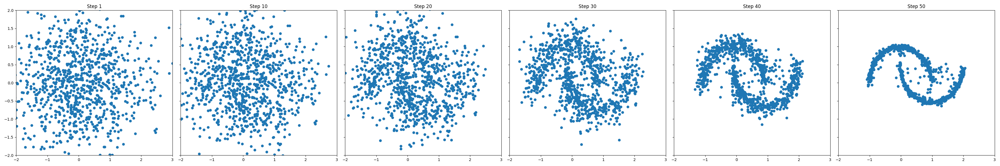
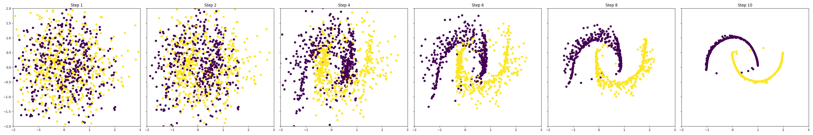

# Simple Diffusion model on two moons distribution

The goal is to train a diffusion model for 2D points to generate the two moons distribution.

# Method

I opted to follow the flow matching framework to model this distribution in which we build a probability path from a simple distribution (e.g., Gaussian) `p` to the target distribution (two moons) `q`. The model is trained to learn a vector field that transforms samples from `p` to `q` using the mean squared error loss between the predicted and true velocity fields. We define a linear path such that sample xt at time `t` is given by:

xt = (1 - t) * x0 + t * x1

where x0 ~ `q` and x1 ~ `p`. The velocity field is given by:

v(xt, t) = x1 - x0

# Metrics

The metrics used to evaluate the model are:

- **Wasserstein Distance**: Measures the distance between the generated distribution and the target distribution.
- **MMD (Maximum Mean Discrepancy)**: A kernel-based metric to compare distributions.
- **Coverage**: Measures how well the generated samples cover the target distribution.
- **Density**: Evaluates the quality of the generated samples in terms of their density estimation.
- **Sinkhorn Distance**: A regularized version of the Wasserstein distance that is computationally more efficient.

# Experiment 1

We need a model which takes as input 2D points and a time step t and outputs a 2D vector. I used a simple MLP with 3 hidden layers of 128 units each and SiLU activations. The time step is simply concatenated to the input points for conditioning.

The model is trained using the AdamW optimizer with a learning rate of 2e-3 and a batch size of 256, weight decay of 0.01. The training is done for 10,000 iterations.

The training logs and metrics are saved to wandb: [https://wandb.ai/shivamshrirao/Distrib_Diffusion/runs/7j14hmty](https://wandb.ai/shivamshrirao/Distrib_Diffusion/runs/7j14hmty)

Within 4,000 iterations, the model is able to generate samples that closely resemble the two moons distribution. Inference for 50 steps.

After 10,000 iterations, the outputs get cleaner.

ADD METRICS PLOT

# Experiment 2

I also explored using sinusoidal positional embeddings for the time step `t` instead of simple concatenation for model to better understand the temporal aspect.

Training logs: [https://wandb.ai/shivamshrirao/Distrib_Diffusion/runs/19s8znjy](https://wandb.ai/shivamshrirao/Distrib_Diffusion/runs/19s8znjy)

The results remain similar at all training iterations.

ADD METRICS PLOT

Given the simplicity of the task and the model working well even in Experiment 1, simple concatenation of `t` seems sufficient for this task.

# Experiment 3

To further improve the model, I experimented with using optimal transport to initialize the samples from the gaussian distribution `p` to be closer to the target distribution `q`. This is done by computing the optimal transport plan between samples from `p` and `q` and using it to map samples from `p` to `q`.

In practice this basically reorders the samples in batch from `p` such that the corresponding samples from `q` are closer. Hence the points have to move shorter distances to reach the target distribution.

Training logs: [https://wandb.ai/shivamshrirao/Distrib_Diffusion/runs/cau5bhft](https://wandb.ai/shivamshrirao/Distrib_Diffusion/runs/cau5bhft)

Results:

Even in just 2000 iterations, the model is able to generate samples that closely resemble the two moons distribution.

| Iterations | **Experiment 1**                                                                                      | **Experiment 3 (Optimal Transport)**                                                                     |
| ------------ | ------------------------------------------------------------------------------------------------------- | ---------------------------------------------------------------------------------------------------------- |
| **2000**   |    |    |
| **4000**   |    |    |
| **10000**  |  |  |

Inference for 50 steps.

As can be seen the model with optimal transport initialization convergences much faster and produces better quality samples. Additionally looking at the inference trajectory, it is much more cleaner and stable, plus the structure of the two moons appears to be forming much earlier in the trajectory.

LOWER LOSS, BETTER METRICS

This also allows the model to be inferred in much lesser steps with good quality samples. Below is comparison of samples generated with different number of inference steps for both experiments.

| Infer Steps | **Experiment 1**                                                                                      | **Experiment 3 (Optimal Transport)**                                                                     |
| ------------ | ------------------------------------------------------------------------------------------------------- | ---------------------------------------------------------------------------------------------------------- |
| **10**   |    |    |
| **5**   |    |    |
| **2**  |  |  |
| **1**  |  |  |

As can be seen in the table above, the model with optimal transport initialization is able to generate good quality samples in much fewer inference steps. Even with just 1 step, the model is able to produce samples that resemble the two moons distribution.

# Experiment 4

Since make moons provides class labels, we can use those to train a class conditional model, and use cfg to further improve the sample quality.

To provide class conditioning, I simply one hot encode the class labels and concatenate them to the input points along with time step `t`. Rest of the setup remains the same as Experiment 3.

Training logs: [https://wandb.ai/shivamshrirao/Distrib_Diffusion/runs/5umtltkm](https://wandb.ai/shivamshrirao/Distrib_Diffusion/runs/5umtltkm)

Results:

With 10 inference steps.
| Training Iterations | **CFG = 1**   | **CFG = 3**  |
| ------------------- | ------------- | ------------- |
| **2000**            |  |  |
| **6000**           |  |  |

As it can be observed, using class conditioning and classifier free guidance further improves the sample quality and the structure of the two moons. The outputs with cfg 3 are very sharp and align almost perfectly with the target distribution.

Also comparing effect of optimal transport at 10 inference steps, cfg 3.

| **Model Type** | **Generated Samples** |
| -------------- | --------------------- |
| **Without Optimal Transport** |  |
| **With Optimal Transport** |  |

The outputs with optimal transport follow straighter paths to the target distribution, while the points in the model without optimal transport can be seen moving back and forth before settling into the target distribution.
